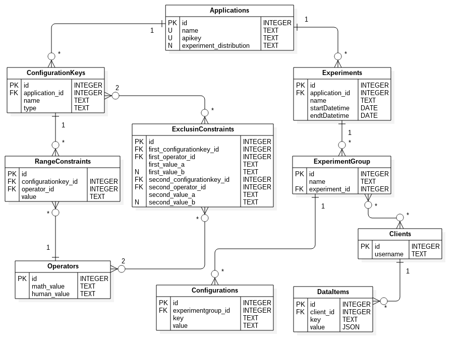
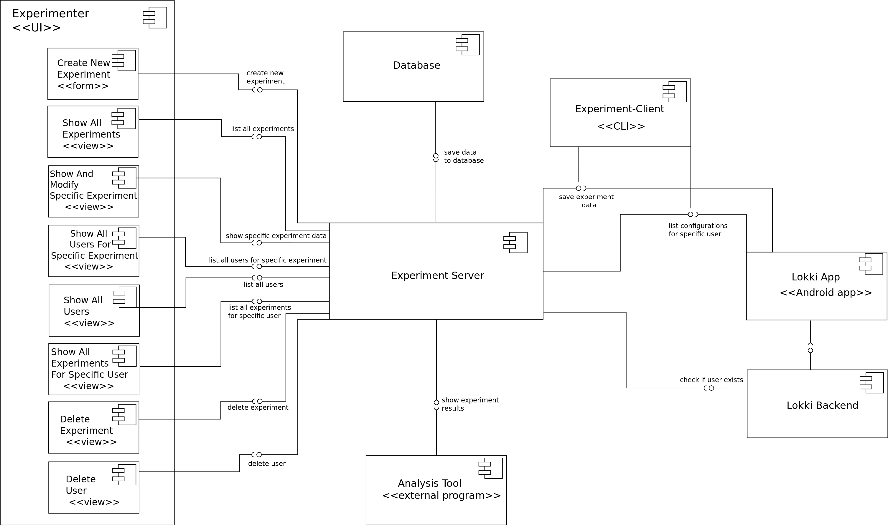

# Documentation

## Experiment-server

API for general (outdated) experiment-data usage (see [domain documentation](Prototype for Continuous Experimentation Server.pdf)). The current project for API-client lives [here](https://github.com/TheSoftwareFactory/experiment-server-ui).

###20th December 2016
Even if outdated, the domain documentation still gives a good general idea of the current structure.

## Domain overview

Disregard Operators-table. It is only used by RangeConstraints and ExclusionConstraints. The core of the 
Experiment-Server is **Applications**-table. Viewing of the database should begin from there. 

Configurations are given to Client and they define how Client's application should be set up for corresponding 
Experiment. Even it is not visible in the database-schema, *Configurations are limited and validated by 
ConfigurationKeys, RangeConstraints and ExclusionConstraints*. ConfigurationKeys' name define Configurations-table's key 
values. If Configuration with some key-value does not refer to another ConfigurationKey's name, its creation will be 
prevented. RangeConstraints and ExclusionConstraints restrict what values Configurations can have. RangeConstraints 
defines one Configuration's possible values. ExclusionConstraints creates restrictions based on two different 
Configurations.

## Architecture overview

## Code overview

- `database/` contains the ORM-model definitions
- `models/` containts all model-definitions which mirror the database tables
- `views/` contains all controllers for route-handling and helper-methods 
- `routes.py` contains the route-mappings

These are the most common directories/files to work on with. Usually the workflow to create new path for API goes like this:

1. Add a path to `routes.py`
2. Make a controller for it
3. Use models to handle data interaction
4. Update swagger.json according to `routes.py` and controller-method created
    1. Also update API-docs: Create new version
    2. Paste swagger.json to editor
    3. Let Editor validate it, re-do part 4 if needed
5. Run server and test it locally. Swagger UI can be downloaded and ran locally    
6. Test newly added path via Swagger UI with staging-version at Heroku

The precise logic should always be at views and the more general should be in models. 

## Status 20.12.2016

Project was heavily refactored. New UI was created

- Front-end
    - Front-end was completely reworked, abandoning old UI completely
    - Focus was on creating a solid ground so it could be easily continued
    - Clear, clean coded, documented, correctly used and up to date React.js front-end including examples
    - Does not yet have all the back-end functionalities implemented
    - More information at [experiment-server-ui-v2](https://github.com/TheSoftwareFactory/experiment-server-ui-v2)
- Back-end
    - API-rework
        - API now represents structure of Experiment-Server
    - Refactored back-end heavily as progressing
    - Removed dependencies to db.py
        - now exists only at tests
    - Backend validation
        - All POST and PUT methods
    - Renamed User to Client
    - Clients' API rework
        - now require new Application's api-key
        - /configurations
            - requests configurations for Client
        - /events
            - relatively same functionality as before
            - now returns 400 if Experiment has ended
    - Experiment Logic Interface
        - Added an abstract class for distribution of Clients to Experiments
        - Added OneRandom distribution strategy
    - Notes:
        - Tests have been updated if something related to them was updated. Old tests are extremely error prone to 
        changes, and do NOT necessary test what their names implicate. Also many tests seem to test different things 
        they should test one thing per method
        - If problems arise, feel free to contact @ArktinenSieni on GitHub
    - TODO:
        - ExperimentGroups POST, create ExperimentGroup
            - This must be done before proceeding
        - Configurations DELETE, PUT
        - new experiment logic

## Status 18.10.2016

We have created a solid base to continue developing of this current API. There still are little bit refactoring to be done. Mostly to get rid off `db.py` and to split tests but mostly creating new functionality should be relatively easy. Next logical features would be to:

* integrate UI to create experiments
* integrate UI to create experimentgroups
* Validate what experimentgroups (and their configurations) are possible to create based on
`rangeconstraints` and `exclusionconstraints`
* decide how users are attached to experimentgroups (create possibility to have multiple different logics for that) 

