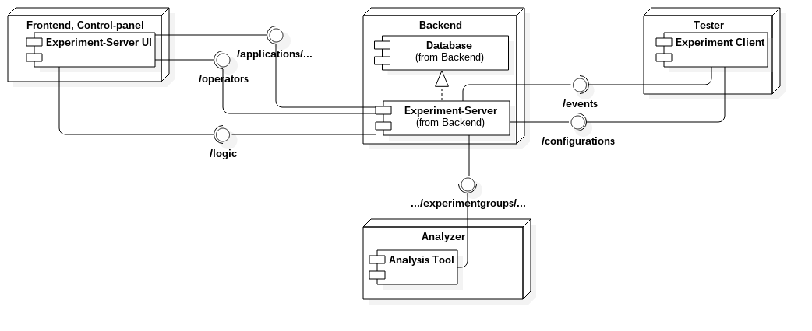

# Documentation

**Warning**: Some of these diagrams in this folder may not be up to date (18.10.2016). Use only as a overview of the current application and how the application has developed since. So check the modification dates.

## Experiment-server

API for general (outdated) experiment-data usage (see [domain documentation](Prototype for Continuous Experimentation Server.pdf)). The current project for API-client lives [here](https://github.com/TheSoftwareFactory/experiment-server-ui).

## Domain overview

. 

## Architecture overview

## Code overview

- `database/` contains the ORM-model definitions
- `models/` containts all model-definitions which mirror the database tables
- `views/` contains all controllers for route-handling and helper-methods 
- `routes.py` contains the route-mappings

These are the most common directories/files to work on with. Usually the workflow to create new path for API goes like this:

1. Add a path to `routes.py`
2. Make a controller for it
3. Use models to handle data changes

The precise logic should always be at views and the more general should be in models. 

## Status 18.10.2016

We have created a solid base to continue developing of this current API. There still are little bit refactoring to be done. Mostly to get rid off `db.py` and to split tests but mostly creating new functionality should be relatively easy. Next logical features would be to:

* integrate UI to create experiments
* integrate UI to create experimentgroups
* Validate what experimentgroups (and their configurations) are possible to create based on
`rangeconstraints` and `exclusionconstraints`
* decide how users are attached to experimentgroups (create possibility to have multiple different logics for that) 

